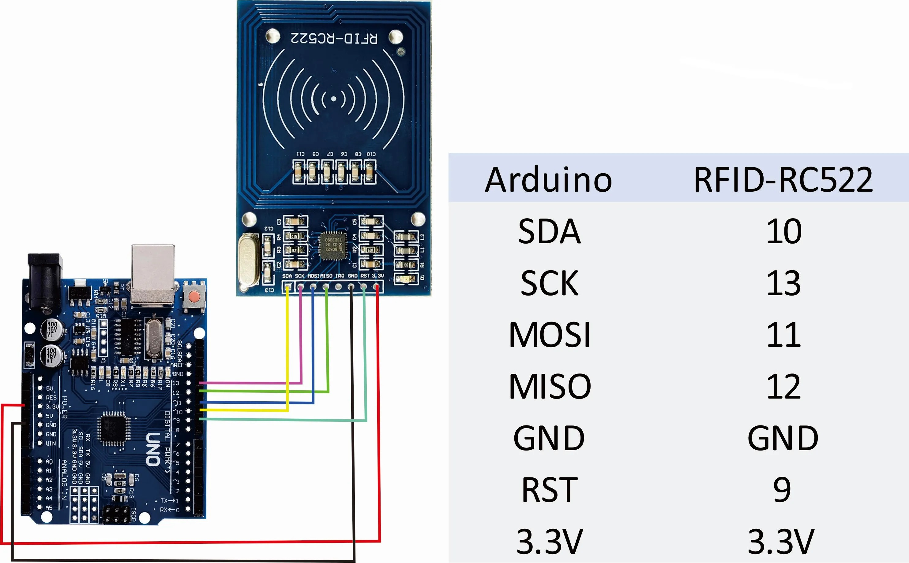
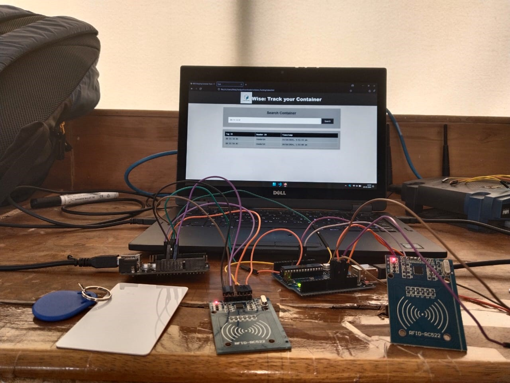
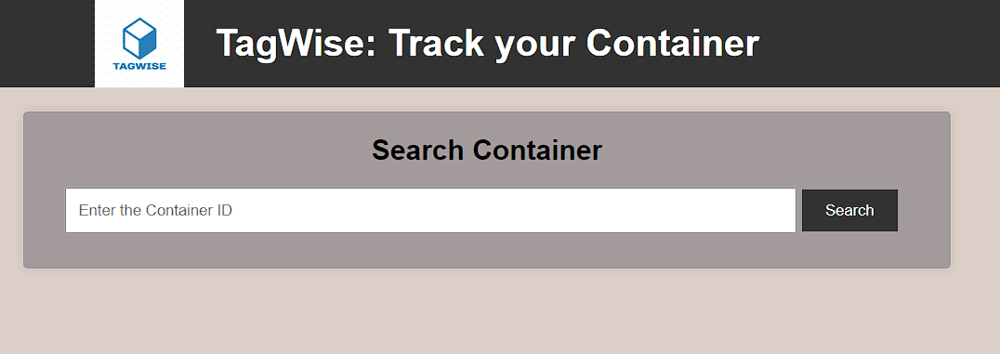
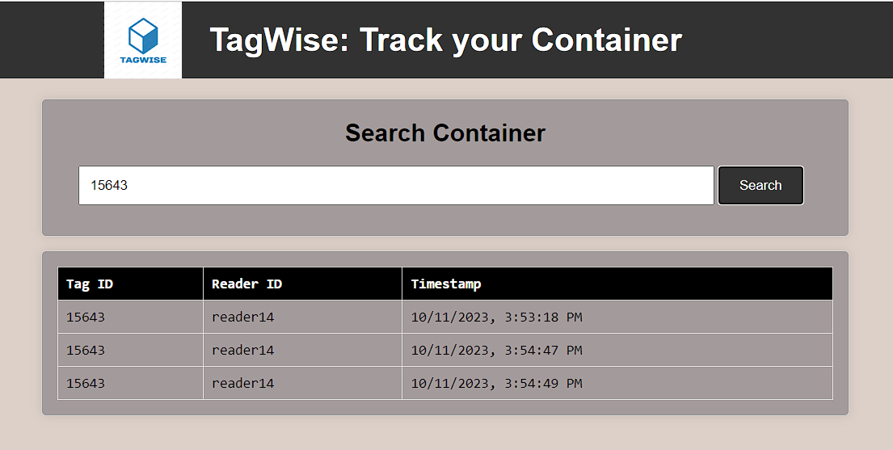

# TagWise - Container Tracking System

TagWise is an innovative project aimed at transforming the logistics and supply chain industry. By leveraging Internet of Things (IoT) technologies, the project provides an accurate and efficient solution for tracking containers throughout the supply chain. The system uses an RFID-based approach to scan, save, and retrieve data, enabling seamless monitoring of container locations in real-time.

This project is developed as part of a college assignment using IoT concepts.

## Table of Contents
1. [Introduction](#introduction)
2. [Prerequisites](#prerequisites)
3. [Usage](#usage)
4. [Pin Diagram](#pin-diagram)
5. [Screenshots](#screenshots)
6. [Demonstration](#demonstration)
7. [Official Documentation](#official-documentation)

## Introduction

The purpose of the **TagWise** project is to create a reliable and real-time container tracking system utilizing RFID technology. By scanning RFID tags attached to containers, the system records and stores location data, providing a precise overview of where each container has been. This solution optimizes logistics operations and enhances supply chain efficiency, making it an ideal tool for industries dealing with large volumes of goods.

This is a college project that integrates hardware components such as the Arduino UNO and RC522 RFID module, with software technologies including Python, JavaScript (Node.js), and MongoDB to create an end-to-end solution.

## Prerequisites

### Hardware Requirements:
- **Arduino UNO**  
- **RC522 RFID Module**
- **RFID Tags**
- **Connecting Wires**

### Technological Requirements:
- **Node.js**: Please refer to the official [installation guide](https://nodejs.org/en/download/).
- **Python**: Please refer to the official [installation guide](https://www.python.org/downloads/).
- **MongoDB**: Please refer to the official [installation guide](https://www.mongodb.com/try/download/community).
- **npm** (Node Package Manager): npm comes bundled with Node.js.

## Usage

1. **Clone the repository**  
   Download or clone the repository to your local system.

2. **Install Python Requirements**  
   Install the necessary Python dependencies as mentioned in the project documentation by **`pip install -r requirements.txt`** 

3. **Install Node.js Requirements**  
   Install the necessary Node.js dependencies as mentioned in the project documentation from "package.json" by **`npm install`** in the root project folder

4. **Hardware Setup**  
   Follow the pin diagram to connect the **RC522 RFID module** to the **Arduino UNO**. The pin diagram can be found in the [Pin Diagram](#pin-diagram)

5. **Run the Project**  
   - Run the **`run.py`** to handle RFID tag scanning and data interaction with the hardware.
   - Run the **`app.js`** to handle the web interface and store data in MongoDB.

## Pin Diagram

The wiring diagram for connecting the **RC522 RFID module** to the **Arduino UNO** is shown below. Please follow the pin diagram carefully:

**Pin Configuration:**
- **SDA** to Pin 10 (CS)
- **SCK** to Pin 13 (SCK)
- **MOSI** to Pin 11 (MOSI)
- **MISO** to Pin 12 (MISO)
- **IRQ** is not connected
- **GND** to Ground
- **RST** to Pin 9 (RESET)
- **3.3V** to 3.3V on Arduino

## Hardware Setup

This is how it looks after connecting the RFID Modules to the Arduino.

## Screenshots

Below are some screenshots showcasing the functionality of the **TagWise** system:

| **Search Page** | **Container Search** |
|-----------------|----------------------|
|   |   |
| *A blank page where users can input the container details they wish to search for.* | *After entering the container information, the system displays all the locations the container has been to.* |

## Demonstration

You can view the full demonstration of the project by following the link below:

[Project Demonstration Video](https://drive.google.com/file/d/1YhwuCCTyVprajNhtcoUD4490ORjJngbw/view?usp=sharing)

## Official Documentation

For detailed documentation of the project, you can access the official college documentation from [this link](https://drive.google.com/file/d/1BQCOc208CSSyByEnlAO9HtvIE1Q8IJQo/view?usp=sharing)

---

### Acknowledgements
- **Arduino** for providing an affordable and versatile platform for rapid prototyping.
- **RC522 RFID Module** for its reliable performance in container tracking.
- **MongoDB** for providing an easy-to-use database solution for storing container data.
- **Node.js and Python** for enabling seamless communication between the hardware and web interface in this IoT-based project.

---

This project aims to demonstrate the practical application of RFID and IoT in real-world supply chain management scenarios. The combination of hardware and software helps achieve a seamless flow of information between the physical and digital worlds.
